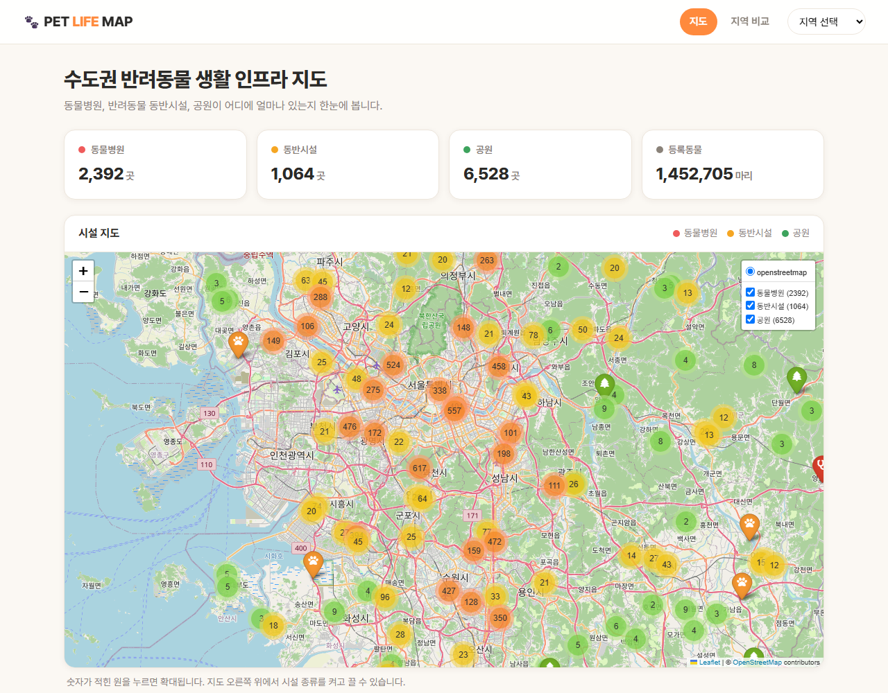
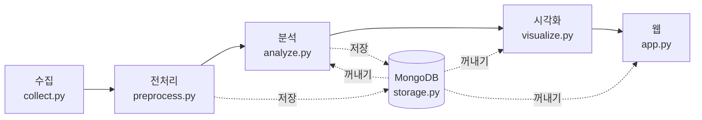
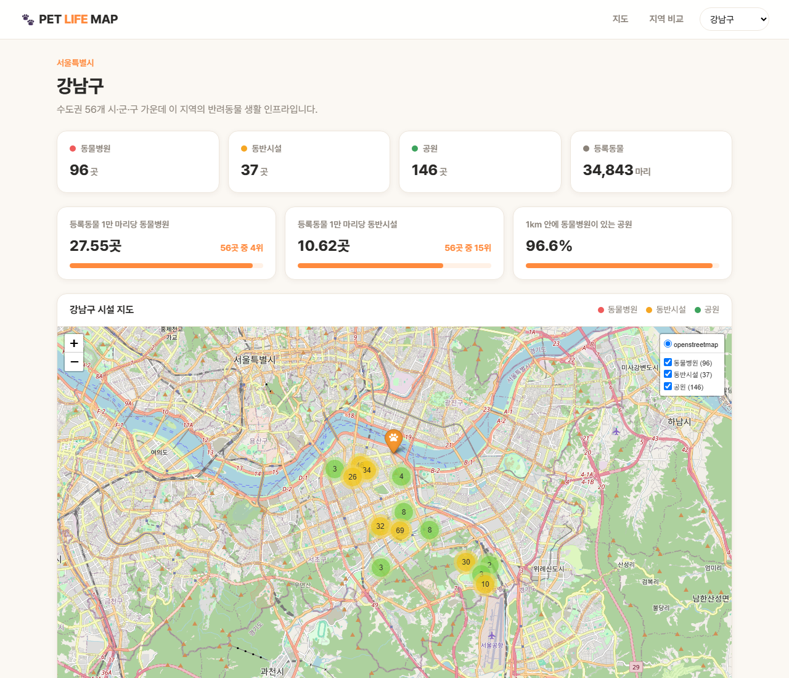
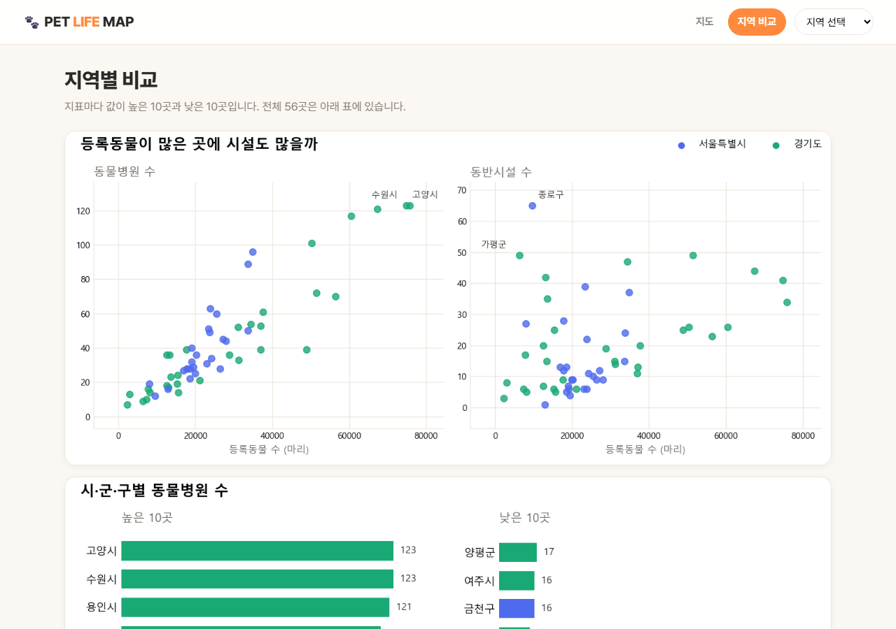

# 35th_sk_shieldus_team6

# 🐾 PET LIFE MAP — 반려동물 생활 인프라 지도

수도권 56개 시·군·구(서울 25개 구 + 경기 31개 시·군)의 **동물병원, 반려동물 동반시설, 공원**을 한 지도에 모으고,
등록된 반려동물 수에 견주어 **어느 지역에 인프라가 많고 적은지** 비교하는 웹 서비스입니다.



---

## 1. 왜 만들었나

반려동물을 키우는 가구는 늘고 있지만, 동물병원·동반시설·공원 정보는 기관마다 따로 흩어져 있습니다.
그래서 "우리 동네는 반려동물 키우기 좋은 곳인가"를 한 번에 알기 어렵습니다.

이 프로젝트에서는 여러 공공데이터를 모아 아래 세 가지를 살펴보고,
지역을 고르면 시설과 지표를 한 화면에서 볼 수 있는 웹 서비스로 만들었습니다.

1. 반려동물 관련 시설은 어느 지역에 집중되어 있는가?
2. 등록동물 수가 많은 지역에 관련 인프라도 많이 분포하는가?
3. 등록동물 수를 고려했을 때 지역별 인프라 차이는 어떻게 나타나는가?

---

## 2. 전체 흐름



| 단계 | 파일 | 하는 일 | 결과물 |
| --- | --- | --- | --- |
| 수집 | `collect.py` | 공공데이터포털 API 호출 | `data/raw/*.csv` |
| 전처리 | `preprocess.py` | 결측치·중복 제거, 지역 이름 통일, 좌표 변환 | `data/processed/*.json`, `*.csv` |
| 분석 | `analyze.py` | 지역별 개수와 지표 | `stats.json` |
| 저장 | `storage.py` | MongoDB에 저장하고 꺼내기 | DB `pet_life_map` |
| 시각화 | `visualize.py` | 그래프 6장, 지도 | `static/` |
| 웹 | `app.py` | Flask 화면 3개 | http://127.0.0.1:5000 |

---

## 3. 데이터 수집

공공데이터 4종을 모았고, 그중 2종은 API로, 2종은 CSV 파일로 받았습니다.

| 데이터 | 제공 기관 | 방식 | 받은 양 | 정리 후 |
| --- | --- | :---: | ---: | ---: |
| 동물병원 | 행정안전부 | API | 5,484건 (전국, 영업 중) | 2,392곳 |
| 반려동물 동반시설 | 한국문화정보원 | API | 30,586건 (서울·경기) | 1,064곳 |
| 동물등록 현황 | 농림축산검역본부 | CSV 파일 | 252행 (전국) | 56개 지역 |
| 도시공원 | 전국 지자체 (표준데이터) | CSV 파일 | 18,295건 (전국) | 6,555곳 |

```python
# collect.py
while True:
    params = {
        "serviceKey": key,
        "pageNo": page,
        "numOfRows": 100,
        "returnType": "json",
        "cond[SALS_STTS_CD::EQ]": "01",  # 영업상태코드 01 = 영업/정상
    }
    response = requests.get(HOSPITAL_URL, params=params, timeout=30)
    body = response.json()["response"]["body"]
    ...
    if len(rows) >= total or len(items) == 0:
        break
    page += 1
```

- 조건 검색으로 필요한 것만 받습니다. (동물병원: 영업 중만 / 동반시설: 서울·경기만)
- 인증키가 없거나 API가 실패하면 미리 받아 둔 CSV 파일로 대신 동작합니다.

---

## 4. 전처리와 저장

### 원본 데이터의 문제와 해결

| 데이터 | 원본의 문제 | 해결 |
| --- | --- | --- |
| 동물병원 | 좌표가 위도·경도가 아니라 **미터 단위**(EPSG:5174) | pyproj로 위도·경도로 변환 |
| 동물병원 | 같은 병원이 여러 줄, 좌표 없는 줄 | 이름+주소로 중복 제거, 좌표 없는 76곳은 개수에만 포함 |
| 동반시설 | 3만 건 중 대부분이 **동물약국·동물병원·용품점** | 카페·여행지·박물관 등 실제 동반시설만 남김 |
| 동물등록 | 시도 소계 줄이 섞임, 옛 이름 "여주군" | 소계 제외, 여주시에 합침 |
| 공원 | 주소 오타 "경개도", 이름에 기호(`` ` ``) | 주소 대신 제공기관명으로 지역 판단, 기호 제거 |
| 동물병원·동반시설 | 지역 단위가 제각각 (`수원시` / `수원시 영통구`) | 경기는 시·군, 서울은 구로 통일 |
| 공통 | "중구"처럼 같은 이름이 여러 시도에 있음 | 항상 (시도, 시·군·구) 짝으로 구분 |

### 좌표 변환

동물병원 원본 좌표는 `197364, 453303` 같은 미터 값이라 지도에 바로 찍을 수 없습니다.

```python
# preprocess.py
transformer = Transformer.from_crs("EPSG:5174", "EPSG:4326", always_xy=True)
lon, lat = transformer.transform(float(x), float(y))
```

변환이 맞는지는 동반시설 데이터에 들어 있는 같은 병원 881곳의 위도·경도와 비교해 확인했습니다.
두 좌표의 차이는 중앙값 약 3m였습니다.

### 저장

정리한 데이터는 저장하는 순간 **CSV, JSON, MongoDB** 세 곳에 한꺼번에 들어갑니다.
따로 저장 명령을 실행할 필요가 없어서, 파일과 DB의 내용이 어긋나지 않습니다.

```
$ python preprocess.py
전처리 시작
  저장: registration 56건 (CSV, JSON, MongoDB)
  저장: hospital 2392건 (CSV, JSON, MongoDB)
  저장: facility 1064건 (CSV, JSON, MongoDB)
  저장: park 6555건 (CSV, JSON, MongoDB)
전처리 끝
```

MongoDB에는 데이터베이스 `pet_life_map` 안에 컬렉션 5개로 나눠 넣습니다.

| 컬렉션 | 내용 | 건수 | 누가 저장 |
| --- | --- | ---: | --- |
| `hospital` | 동물병원 (이름, 지역, 주소, 전화번호, 위도·경도) | 2,392 | 전처리 |
| `facility` | 동반시설 (이름, 종류, 지역, 주소, 운영시간, 위도·경도) | 1,064 | 전처리 |
| `park` | 공원 (이름, 종류, 지역, 면적, 위도·경도) | 6,555 | 전처리 |
| `registration` | 지역별 등록동물 수 | 56 | 전처리 |
| `stats` | 지역별 시설 수와 지표 | 56 | 분석 |

**넣기.** 다시 실행해도 같은 데이터가 두 번 들어가지 않게, 있던 내용을 지우고 새로 넣습니다.

```python
# storage.py
def save_one(name, rows):
    db = get_db()
    if db is None:        # MongoDB가 꺼져 있으면 파일로만 저장하고 계속 진행
        return False
    ...
    db[name].delete_many({})
    db[name].insert_many(copies)
    db[name].create_index([("sido", 1), ("city", 1)])   # 지역으로 빨리 찾기 위한 색인
    return True
```

**꺼내기.** 분석, 그래프, 웹이 모두 같은 함수로 꺼내 씁니다. 지역을 주면 그 지역 것만 가져옵니다.

```python
# storage.py — 한 지역의 데이터만 꺼내기
query = {"sido": sido, "city": city}
return list(db[name].find(query, {"_id": 0})) 
```

---

## 5. 분석

시설 개수만 세면 인구가 많은 큰 도시가 늘 1등을 차지합니다.
그래서 **등록된 반려동물 수로 나눈 정규화 지표**를 만들어 실제 체감 인프라를 비교했습니다.

| 지표 | 계산 공식 | 의미 |
| --- | --- | --- |
| **등록동물 1만 마리당 동물병원** | `(동물병원 수 ÷ 등록동물 수) × 10,000` | 반려동물 한 마리가 누리는 병원 접근성 |
| **등록동물 1만 마리당 동반시설** | `(동반시설 수 ÷ 등록동물 수) × 10,000` | 반려동물과 함께 갈 수 있는 문화·여가 인프라 밀도 |

---

## 6. 시각화와 웹 서비스

정제되고 분석된 데이터는 Flask 웹 서비스와 Folium 지도, Matplotlib 그래프를 통해 사용자가 직접 탐색할 수 있는 3개 화면으로 구현했습니다.

### ① 수도권 전체 지도 (메인 대시보드 — `/`)

* **마커 클러스터링 (`MarkerCluster`)**: 병원, 동반시설, 공원을 합치면 약 1만 건에 달합니다. 지도가 버벅거리지 않도록 가까운 마커들을 숫자가 적힌 원으로 묶었고, 누르면 부드럽게 확대됩니다.
* **레이어 컨트롤 (`LayerControl`)**: 오른쪽 위 체크박스에서 보고 싶은 시설(동물병원 빨강, 동반시설 주황, 공원 초록)을 켜고 끌 수 있습니다.
* **상단 요약 카드**: 수도권 전체 시설 합계와 등록동물 수를 한눈에 볼 수 있습니다. (맨 위 첫 화면 그림)

### ② 시·군·구 상세 분석과 실시간 순위 (지역 검색 — `/city/<sido>/<name>`)

* 헤더의 드롭다운에서 특정 지역을 고르면 그 지역만의 인프라 상세 정보가 열립니다.
* **실시간 랭킹 산출**: 해당 지역이 수도권 56개 시·군·구 중 몇 위인지 실시간으로 정렬 계산하여 순위(Rank)를 보여 줍니다.
* **지역 전용 지도 및 시설 목록**: 그 지역에 있는 시설만 모은 전용 지도와 함께, 동반시설의 명칭, 업종, 도로명주소, 운영시간 목록을 표로 제공합니다.



### ③ 지역별 비교 대시보드와 동적 표 정렬 (지역 비교 — `/compare`)

* **지표별 비교 그래프**: 주요 지표마다 값이 가장 높은 10곳과 가장 낮은 10곳을 나란히 비교한 가로 막대그래프를 배치했습니다. (서울은 파란색, 경기는 초록색으로 구분)
* **동적 정렬 테이블**: 표 머리글(등록동물, 병원, 동반시설 등)을 클릭하면 해당 수치가 높은 순서대로 전체 56개 지역 표가 즉시 재정렬됩니다.



---

## 7. 알아낸 것 (핵심 인사이트 3가지)

### 동물병원은 반려동물이 많은 곳에 집중되어 있지 않습니다 (수요와 공급의 불일치)

1. **시설이 몰려 있는 주요 지역**: 
   * **서울 도심 핵심지**와 **경기 주요 대도시**에 동물병원이 집중되어 있습니다. Absolute(절대량) 수치 기준으로는 강남구(96개), 서초구(63개) 등 상권 발달 지역과 수원시(123개), 고양시(123개) 등 인구 밀집 지역에 절대수가 많습니다.

2. **등록동물 수와 시설 위치의 관계**:
   * 거주 동물 수(수요)와 인프라(공급)는 전혀 일치하지 않습니다.
   * [수원시](http://127.0.0.1:5000/compare?id=8)(75,775마리)나 [고양시](http://127.0.0.1:5000/compare?id=9)(74,752마리)는 등록동물 수가 수도권 최상위권이지만, **등록동물 1만 마리당 동물병원 수**는 각각 **16.23개, 16.45개**로 중간 수준에 그칩니다.

3. **지역별 인프라 격차 및 핵심 결론**:
   * 등록동물 1만 마리당 병원 수가 가장 많은 [과천시](http://127.0.0.1:5000/compare?id=62)(44.20개)와 가장 적은 [안산시](http://127.0.0.1:5000/compare?id=15)(7.99개)는 **약 5.5배의 큰 인프라 격차**를 보입니다.
   * **결론**: 동물병원은 실제 거주 동물 수가 많은 주거 지역보다 **상권이 형성되고 임대료·소득 수준이 높은 특정 상업 지역 중심으로 편중 개업하는 경향**을 보입니다. 따라서 반려인이 체감하는 의료 접근성은 거주지 주변의 동물 수보다 **지역 상권 환경의 지리적 영향**을 훨씬 더 크게 받습니다.

---

## 8. 한계

* **데이터 시점의 불일치**: 동물등록 통계는 2022년 말 기준이며, 병원 인허가 및 동반시설은 현재 시점 자료입니다.
* **미등록 개체 누락**: 등록 의무가 없는 고양이나 미등록 반려견은 집계에서 빠져 있어 실제 양육 규모는 더 클 수 있습니다.
* **지자체 등록 편차**: 공원 데이터는 지자체가 공공포털에 등록한 정보만 포함되어 있어(노원구는 4건만 등록), 실제 체감 공원 수와 다를 수 있습니다.

---

## 9. 수업 밖에서 더 쓴 것

| 기술 및 라이브러리 | 사용 위치 | 도입 이유 |
| :--- | :--- | :--- |
| **`folium` & `MarkerCluster`** | `visualize.py` | 1만여 개의 마커를 브라우저 멈춤 없이 띄우고, 종류별 레이어를 켜고 끄기 위해 |
| **`matplotlib.use("Agg")`** | `visualize.py` | 웹 서버 백그라운드에서 윈도우 창 팝업 오류 없이 차트 이미지를 파일로 일괄 저장하기 위해 |
| **`pyproj`** | `preprocess.py` | 동물병원 원본 좌표가 미터 단위(EPSG:5174)라 위도·경도(EPSG:4326)로 정밀 변환하기 위해 |
| **상관계수 (피어슨)** | `analyze.py` | "반려동물이 많은 곳에 시설도 많은가"를 객관적 숫자로 입증하기 위해 |
| **API 페이징 자동화** | `collect.py` | 100건 제한이 걸린 공공데이터 API를 55번 나눠 받아 전체 수집하기 위해 |

---


## 10. 실행 방법

```bash
pip install -r requirements.txt  # 의존성 패키지 설치
python collect.py                # 공공데이터 API 수집 (인증키 없을 시 기존 raw 파일로 동작)
python preprocess.py             # 결측치 정제
python analyze.py                # 지표 계산 및 stats.json 생성
python storage.py                # MongoDB에 자동으로 저장
python visualize.py              # 그래프와 지도 만들기
python app.py                    # 웹 실행
```

- 실행하기에 앞서 공공데이터포털 인증키가 필요합니다. `.env.example`을 `.env`로 복사한 뒤 키를 넣으세요.
  키가 없으면 건너뛰어도 되고, 그때는 미리 받아 둔 CSV 파일로 동작합니다.
- 'storage.py'는 MongoDB가 켜져 있어야 합니다. 건너뛰면 웹이 JSON 파일을 읽습니다.

### 폴더 구성

```
pet-life-map/
├── collect.py  preprocess.py  analyze.py  storage.py  visualize.py  app.py
├── config.py            설정 (분석 지역, 파일 경로, 기준값)
├── data/raw/            원본 데이터
├── data/processed/      정리한 데이터 (CSV, JSON)
├── templates/           웹 화면 (HTML)
├── static/              그래프, 지도, 스타일
└── docs/                README용 화면 캡처
```

### 데이터 출처

- 행정안전부 동물병원 조회서비스 (공공데이터포털 15154952)
- 한국문화정보원 전국 반려동물 동반 가능 문화시설 위치 데이터 (15111389)
- 농림축산검역본부 행정구역별 반려동물등록 개체 수 현황 (15125454)
- 전국도시공원정보표준데이터 (15012890)